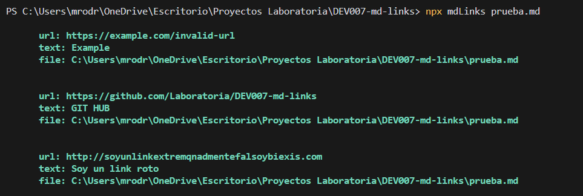
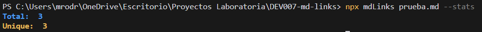
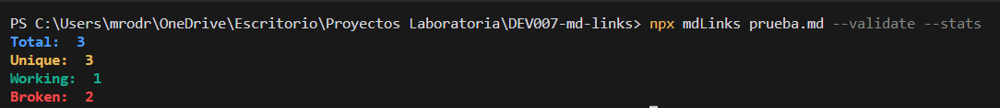

# Markdown Links

## 1. Preámbulo

[Markdown](https://es.wikipedia.org/wiki/Markdown) es un lenguaje de marcado
ligero muy popular entre developers. Es usado en muchísimas plataformas que
manejan texto plano (GitHub, foros, blogs, ...) y es muy común
encontrar varios archivos en ese formato en cualquier tipo de repositorio
(empezando por el tradicional `README.md`).

Estos archivos `Markdown` normalmente contienen _links_ (vínculos/ligas) que
muchas veces están rotos o ya no son válidos y eso perjudica mucho el valor de
la información que se quiere compartir.

Dentro de una comunidad de código abierto, nos han propuesto crear una
herramienta usando [Node.js](https://nodejs.org/), que lea y analice archivos
en formato `Markdown`, para verificar los links que contengan y reportar
algunas estadísticas.

## 2. Resumen del proyecto

En este proyecto es una herramienta de línea de comando (CLI) y librería en JavaScript, que se ejecuta a través de Node.js 
que es un entorno de ejecución para JavaScript construido con el [motor de JavaScript V8 de Chrome](https://developers.google.com/v8/).
que nos permite ejecutar Javascript en el entorno del sistema operativo, ya sea tu máquina o un servidor, lo cual nos abre las puertas para poder
interactuar con el sistema en sí, archivos, redes, etc.

#### La herramienta consta de dos partes :

#### 1) JavaScript API
El módulo debe poder importarse en otros scripts de Node.js y debe ofrecer la siguiente interfaz:

<code> mdLinks(path, options) </code>

#### Argumentos

<code>path:</code> Ruta absoluta o relativa al archivo o directorio. Si la ruta pasada es relativa, debe resolverse como relativa al directorio desde donde se invoca node - current working directory).

<code>options:</code> Un objeto con únicamente la siguiente propiedad:

<code>validate:</code> Booleano que determina si se desea validar los links encontrados.

#### Valor de retorno:
La función debe retornar una promesa (Promise) que resuelva a un arreglo (Array) de objetos (Object), donde cada objeto representa un link y contiene las siguientes propiedades

Con <code>validate:false:</code>

<code>href: </code> URL encontrada.

<code>text:</code> Texto que aparecía dentro del link (<a>).

<code>file:</code> Ruta del archivo donde se encontró el link.

Con <code>validate:true: </code>

<code>href:</code> URL encontrada.

<code>text:</code> Texto que aparecía dentro del link (<a>).

<code>file:</code> Ruta del archivo donde se encontró el link.

<code>status:</code> Código de respuesta HTTP.

<code>ok:</code> Mensaje fail en caso de fallo u ok en caso de éxito.

#### 2) CLI (Command Line Interface - Interfaz de Línea de Comando)

El ejecutable de nuestra aplicación se ejecuta:

<code>mdLinks path-to-file [options] </code>

Options

<code>--validate</code>
Si pasamos la opción <code>--validate</code>, el módulo debe hacer una petición HTTP para averiguar si el link funciona o no. Si el link resulta en una redirección a una URL que responde ok, entonces consideraremos el link como ok.

<code>--stats</code>
Si pasamos la opción <code>--stats</code> el output (salida) será un texto con estadísticas básicas sobre los links considerando:

<code>{Total: 3, Unique: 3}</code>

También podemos combinar <code>--stats</code> y <code>--validate</code> para obtener estadísticas que necesiten de los resultados de la validación.

<code>{Total: 3, Unique: 3, Broken: 1}</code>

## Diagrama de flujo 

## Instalación e Instrucciones uso
#### Instalación 
Para instalar la libreria posicionese dentro de su carpeta y abra la terminal para colocar el siguiente comando: 
<code>npm i md-links-mafer-rodriguez</code>

#### Modo de uso
El ejecutable de esta aplicación se realiza de siguiente manera a través de la terminal: 
<code> mdLinks path-to-file [options] </code>

1.- Si ejecutamos en nuestra terminal el argumento <code>path</code>, de esta manera: <code> mdLinks path-to-file </code> le estamos indicando a la herramienta la ruta del archivo que quieres revisar, puede ser una ruta relativa o absoluta. y nos retornará un resumento de los links de esa ruta. Lo cual se verá de la siguiente manera: 

2.- Si ejecutamos en nuestra terminal el argumento <code> [options] </code>, de las cuales tenemos disponibles:

  <code> --validate </code>, <code> --stats </code>, o ambas <code> --validate -- stats </code> va a evaluar ciertas características: 

 <code> --validate </code>: El módulo hace una petición HTTP para averiguar si el link funciona o no.

 <code> --stats </code>: El módulo nos muestra las estadísticas básicas sobre los links, el total de links y los links únicos. 

 <code> --validate --stats </code>: El módulo entregará estadistica completa de los links, en donde mostrará también los links rotos o no válidos. 

## Planificación de Proyecto:

Este proyecto se realizó en 4 sprints, utilizando la herramienta de [GIT HUB PROJECTS](https://github.com/Laboratoria/DEV007-md-links)

 
 

